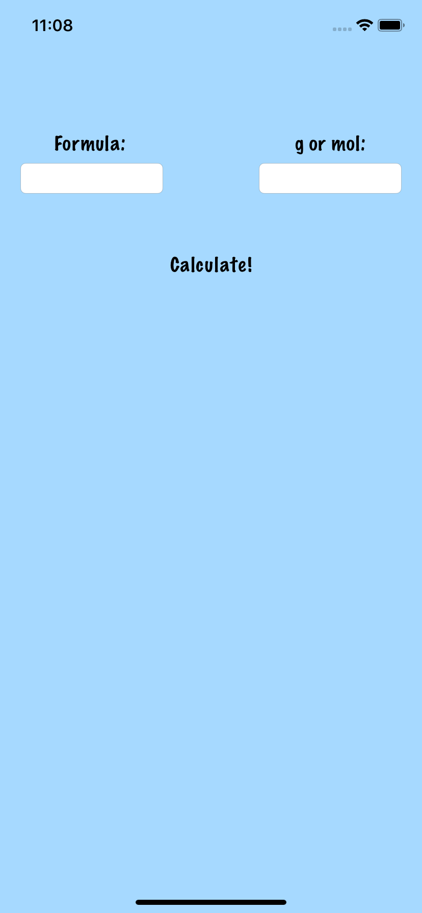
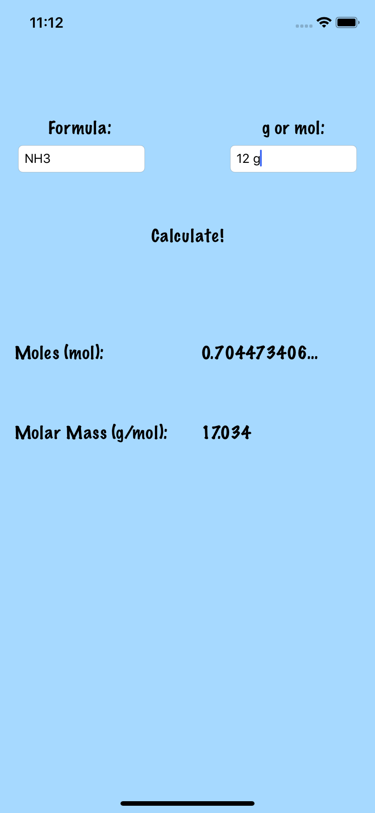
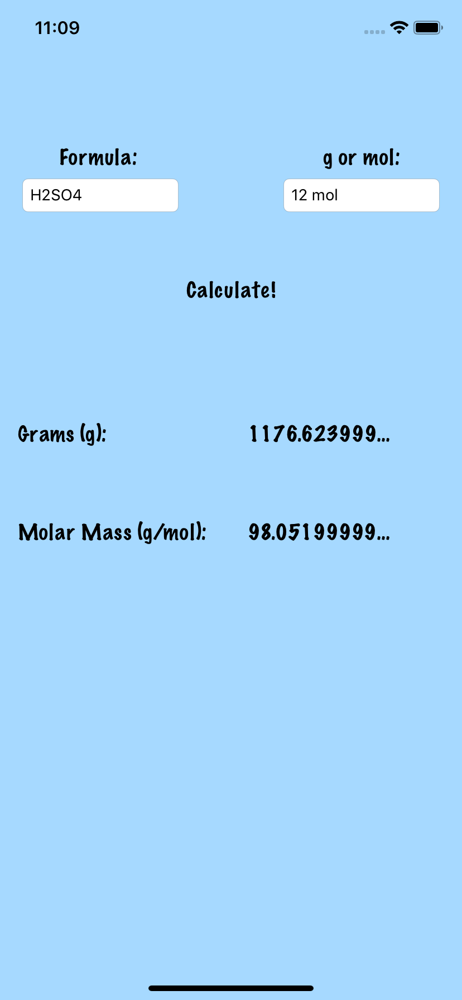

# ChemistryWeightConverter
An iOS application that converters between grams and moles

   

## The Atom Class
This class holds the properties of an Atom - The atomic number, atomic weight, atomic symbol

The valid atomic numbers are between 1-58 & 72-83 (The other elements are Lanthanoids, Actinoids, or lab-made elements that aren't common)

## The Molecule Class
This class manages all of the atoms in the program. The constructor takes in a String that contains the molecular formula

The `dissectMolecule()` function takes the String that contains the molecular formula and breaks each character into their respective atom. This works in conjunction with the `findAtomicNumber(atomicSymbol: String)`function which finds the atomic number based on the given atomic symbol.

